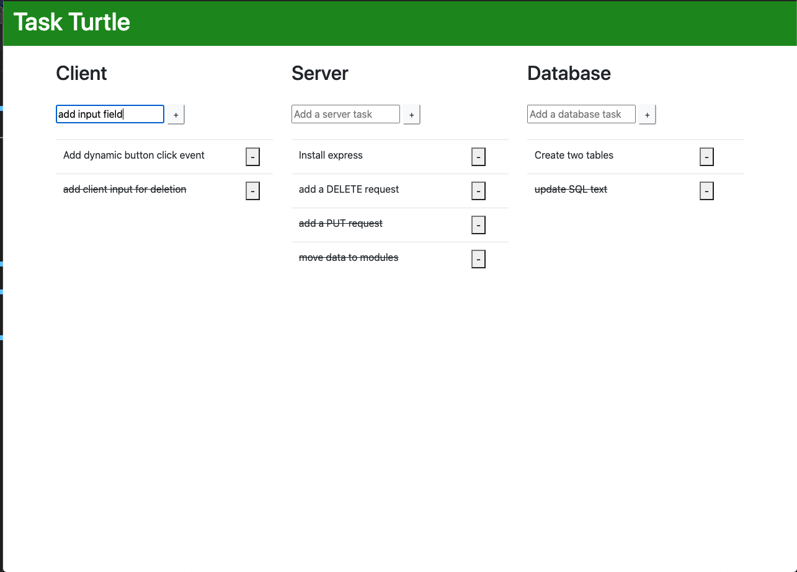

# Task Turtle

## Description

Our client, Koala Holla (1976 Llama Comma Drive, Walla Walla WA) is a non-profit dedicated to the ethical transitioning of koalas from the outdoors (whereupon they may be rained) to urban areas where roofs exist. Your team has been hired to build a web app to handle their terrarium residents.

## Screenshot
--------

##Installation

- gitHub repository files
- node.js
- Node package manager (npm)
- Express
- Bootstrap
- PG

1. Fork and clone the repository from gitHub
2. Initialize npm package manager at the root local folder in command line with: 'npm -init y'
3. Install node.js with command: 'npm install node'
4. Install express with command: 'npm install express'
5. Install PG with command: 'npm install pg'
6. Create a SQL database named 'koala_database' 
7. Use the query commands found in the database.sql file to build a koalas table

##Built With

- html
- css
- javascript
- jQuery 
- express
- node.js
- Bootstrap
- SQL

## License
[MIT](https://choosealicense.com/licenses/mit/)

## Acknowledgement
Thanks to [Prime Digital Academy](www.primeacademy.io) who equipped helped me make this application a reality. Sepcial thanks to our primary instructor, [Mary Mossman](https://github.com/mbMosman)

This application was built by:
- [Malik Elate](https://github.com/MalikElate)

## Support
If you have suggestions or issues, please contact me through github.
